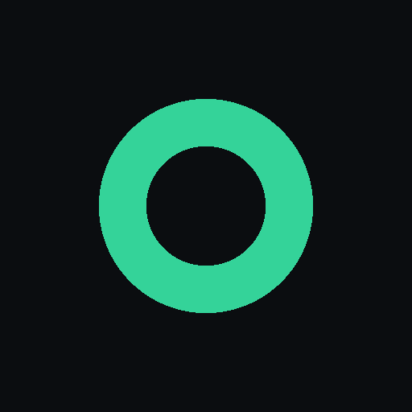

<div align="center">



<h1>omp-plug</h1>

<p><b>Drive your omp coding agents from your phone.</b></p>

<p>A self-hosted dashboard for your <a href="https://www.npmjs.com/package/@oh-my-pi/pi-coding-agent">omp</a> coding-agent sessions, built for the phone.<br />Watch a run, answer what it's stuck on, or kick off a new one from any browser on your tailnet.</p>

<p>
  <a href="LICENSE"></a>
  
  
</p>

<p>
  <a href="#what-you-get">Features</a> ·
  <a href="#how-it-fits-together">How it works</a> ·
  <a href="#quick-start">Quick start</a> ·
  <a href="#contributing">Contributing</a>
</p>

</div>

---

You run `omp` on your machine. omp-plug lets you watch and steer those sessions from a browser anywhere, without walking back to the keyboard. See every session, drive a live one (prompt, steer, answer its questions, abort), and create, rename, resume, or delete sessions and projects. The desktop layout is a first-class peer, not a stretched phone view.

## Why this exists

Long agent runs don't fit at a desk. You kick one off, wander away, and it stalls on some yes/no it won't decide on its own, stuck there until you walk back. omp-plug closes that gap: the loop finishes from your pocket.

The part that makes it real is a small extension (`omp-report`) that loads *inside every omp session*. It's the only thing that can actually see or drive a session, and the server bridges those sessions to your browser over WebSocket. So when you answer an `ask` from your phone, it lands as a genuine native tool result, not a replayed keystroke. A terminal-in-a-web-page can't honestly claim that.

## What you get

- **Every session in one list**, persisted history merged with the live registry, grouped by project (working directory), newest first.
- **Live transcripts** streamed as they happen: text and thinking deltas, tool start/end, rendered markdown, syntax-highlighted code, images.
- **Real control of a running session** — prompt, steer mid-turn, abort, and answer a native `ask` dialog straight from the browser.
- **Full session lifecycle**: create a session in any directory, rename it (live or on disk), resume an inactive one so it's queryable again, and delete it safely. A session the server didn't spawn is never killed.
- **Shell escapes** from the composer: `!cmd` runs a shell command in the session's cwd and feeds the output back to the agent next turn; `!!cmd` is a private peek that the agent never sees.
- **Voice input**: a mic button in the composer dictates hands-free — speak and the words are transcribed in the browser (Web Speech API) and dropped into the message box. Needs a secure context (HTTPS/localhost); hidden where unsupported.
- **Web Push to your phone** when a session goes idle or raises a question, deep-linking straight to it. Installable as a PWA.

## How it fits together

```
 omp session (extension)  ──ws──▶  server  ──ws──▶  browser (web/)
        ▲  /ws/agent                 │  /ws/client
        └────────  control commands ─┘   (prompt/steer/answer/rename/abort)
```

One Bun process serves the built React UI and bridges two WebSocket populations. Three planes live in `server/src`: **history** (durable, reads persisted sessions), **live** (in-memory registry of connected agents), and **spawn** (launches new sessions as `omp --mode rpc-ui` children and tracks them by pid). Deeper detail is in [`docs/architecture.md`](docs/architecture.md).

## Requirements

- [Bun](https://bun.sh) 1.3.14 or newer.
- `omp` installed globally (the `@oh-my-pi/pi-coding-agent` SDK). omp-plug resolves it at runtime from your global Bun install rather than vendoring its whole dep tree; the reasoning is in [`DECISIONS.md`](DECISIONS.md).
- macOS if you want the one-command installer (it uses launchd). Everything runs on Linux too; you just start the server yourself instead of through the install script.
- Optional but recommended: [Tailscale](https://tailscale.com), so you can reach the dashboard from your phone without exposing a port to the internet.

## Quick start

Clone it, install, and run the server:

```sh
git clone https://github.com/Ibrahim925/omp-plug.git
cd omp-plug
make setup            # bun install
make build            # build the web UI into web/dist
make start            # serve on http://0.0.0.0:7317
```

Then load the `omp-report` extension so your omp sessions report in. The installer does both sides on macOS:

```sh
./scripts/install.sh --token <your-secret>
```

That symlinks the extension into `~/.omp/agent/extensions/`, writes your config to `~/.omp-plug.json`, and (unless you pass `--no-dashboard`) builds the UI and registers a launchd service so the dashboard runs at login. On a machine that only *runs* omp and talks to a dashboard elsewhere:

```sh
./scripts/install.sh --no-dashboard --url ws://<dashboard-host>.ts.net:7317 --token <your-secret>
```

Open `http://<host>:7317`, enter the token, and your sessions show up. Start a fresh omp session (or resume one from the dashboard) and it appears live.

Full install, config, and deploy notes are in [`docs/deploy.md`](docs/deploy.md).

## Configuration

Everything lives in `~/.omp-plug.json` (chmod 600), the single source of truth for both the server and the extension:

```json
{ "url": "ws://127.0.0.1:7317", "token": "<shared-secret>" }
```

`token` is a shared secret. Set it and every `/api/*` route plus the browser WebSocket require it (via the `x-omp-token` header, a `?token=` query param, or the `omp_token` cookie); `/api/health` and static assets stay open. Leave it empty and the server is open — fine on loopback, reckless on a shared network. `OMP_PLUG_URL` and `OMP_PLUG_TOKEN` override the file.

## Push notifications

The dashboard can ping your phone when a session finishes a turn or needs an answer. Two things to know before you flip the bell on:

- **HTTPS is mandatory.** Browsers only accept a push subscription in a secure context, so plain-HTTP `:7317` won't cut it and the toggle stays disabled. Put it behind TLS, e.g. `tailscale serve --bg 7317`, and open the port-less `https://<host>.ts.net` URL.
- **iOS means Safari, and you have to install it.** Every iOS browser is WebKit, and Apple only grants Web Push to a home-screen app. Open the HTTPS URL in Safari 16.4+, **Share → Add to Home Screen**, launch from the icon, then enable the bell inside it.

The VAPID keypair and your device subscriptions persist to `~/.omp-plug-push.json`. Don't delete or regenerate it or every device has to re-subscribe. See [`docs/deploy.md`](docs/deploy.md) for the details, including the `mailto:`-subject gotcha that Apple rejects with `403 BadJwtToken`.

## Development

```sh
make dev       # server with --watch (serves an existing web/dist)
make dev-web   # Vite dev server with HMR, proxies /api -> :7317
make check     # the gate: web typecheck + tests
```

The web client is strict TypeScript. The server and extension are Bun-runtime TypeScript with no author-time SDK types (the SDK isn't build-visible), so `make check` typechecks the web workspace and runs the Bun test suite. Read [`docs/code-style.md`](docs/code-style.md) before writing code, and [`docs/wire-contract.md`](docs/wire-contract.md) before touching any message shape — the wire contract is hand-mirrored across the extension, server, and web, and all three change together.

## A note on security

Built for one operator on a network you control, loopback or your own tailnet. There's no multi-tenant story here: no accounts, no roles, just one shared secret gating everything. So don't hang it off the public internet. If you need it reachable from outside your LAN, put it on a tailnet and let Tailscale own identity and transport instead of opening 7317 to whoever's scanning that day.

## Contributing

Forks and pull requests are welcome. Start with [`CONTRIBUTING.md`](CONTRIBUTING.md), which covers the dev loop and the handful of conventions that keep this codebase honest (chief among them: change every side of a wire shape together). The `docs/` folder is the map.

## License

MIT — see [`LICENSE`](LICENSE).
